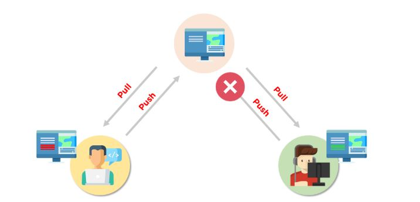

# Git
Git est un système de contrôle de version distribué (VCS) open source, qui dispose d'un référentiel distant côté serveur et d'un référentiel local côté client. Cela signifie que le fichier ou le code n'est pas présent sur un serveur central, mais qu'il existe une copie du fichier stockée sur l'ordinateur du client. 

# Commandes Git de base
- configuration git 
- git init
- git ajouter 
- git diff
- git commet
- réinitialisation de git
- statut git
- git fusionner
- git pousser
- git tirer

# Qu'est-ce qu'un conflit de fusion Git ?
Un conflit de fusion est un événement qui se produit lorsque Git est incapable de résoudre automatiquement les différences de code entre deux commits. Git peut fusionner les modifications automatiquement uniquement si les commits se trouvent sur des lignes ou des branches différentes.

Voici un exemple du fonctionnement d'un conflit de fusion Git :

Supposons qu'il y ait deux développeurs : le développeur A et le développeur B. Tous deux extraient le même fichier de code du référentiel distant et essaient d'apporter diverses modifications à ce fichier. Après avoir apporté les modifications, le développeur A renvoie le fichier vers le référentiel distant à partir de son référentiel local. Maintenant, lorsque le développeur B essaie de pousser ce fichier après avoir apporté les modifications de son côté, il est incapable de le faire, car le fichier a déjà été modifié dans le référentiel distant.

Pour éviter de tels conflits, les développeurs travaillent dans des branches isolées séparées. La commande Git merge combine des branches distinctes et résout toutes les modifications en conflit.

Maintenant que nous avons passé en revue les bases du conflit de fusion Git, examinons ensuite les différents types de conflits.

# Comment résoudre les conflits de fusion dans Git ?
ll existe quelques étapes qui pourraient réduire les étapes nécessaires pour résoudre les conflits de fusion dans Git.

1. Le moyen le plus simple de résoudre un fichier en conflit consiste à l'ouvrir et à apporter les modifications nécessaires.
2. Après avoir édité le fichier, nous pouvons utiliser la commande git add a pour mettre en scène le nouveau contenu fusionné
3. La dernière étape consiste à créer un nouveau commit à l'aide de la commande git commit
Git créera un nouveau commit de fusion pour finaliser la fusion
Examinons maintenant les commandes Git qui peuvent jouer un rôle important dans la résolution des conflits.

# Commandes Git pour résoudre les conflits

1. git log --merge 
La commande git log --merge permet de produire la liste des commits à l'origine du conflit

2. git diff 
La commande git diff permet d'identifier les différences entre les référentiels ou fichiers d'états

3. paiement git 
La commande git checkout est utilisée pour annuler les modifications apportées au fichier ou pour changer de branche

4. git reset --mixed 
La commande git reset --mixed est utilisée pour annuler les modifications apportées au répertoire de travail et à la zone de staging

5. git merge --abort
La commande git merge --abort aide à quitter le processus de fusion et à revenir à l'état avant le début de la fusion

6. réinitialisation de git
La commande git reset est utilisée au moment du conflit de fusion pour réinitialiser les fichiers en conflit à leur état d'origine

# Démo : Résoudre les conflits de fusion Git:
Tout d'abord, initialisez deux dépôts : 

