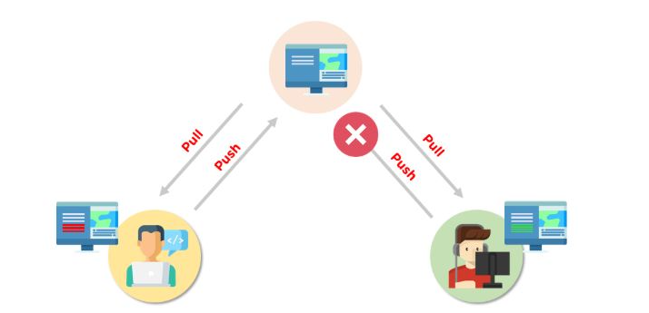

# Git
Git est un système de contrôle de version distribué (VCS) open source, qui dispose d'un référentiel distant côté serveur et d'un référentiel local côté client. Cela signifie que le fichier ou le code n'est pas présent sur un serveur central, mais qu'il existe une copie du fichier stockée sur l'ordinateur du client. 

# Commandes Git de base
- configuration git 
- git init
- git ajouter 
- git diff
- git commet
- réinitialisation de git
- statut git
- git fusionner
- git pousser
- git tirer

# Qu'est-ce qu'un conflit de fusion Git ?
Un conflit de fusion est un événement qui se produit lorsque Git est incapable de résoudre automatiquement les différences de code entre deux commits. Git peut fusionner les modifications automatiquement uniquement si les commits se trouvent sur des lignes ou des branches différentes.

Voici un exemple du fonctionnement d'un conflit de fusion Git :
